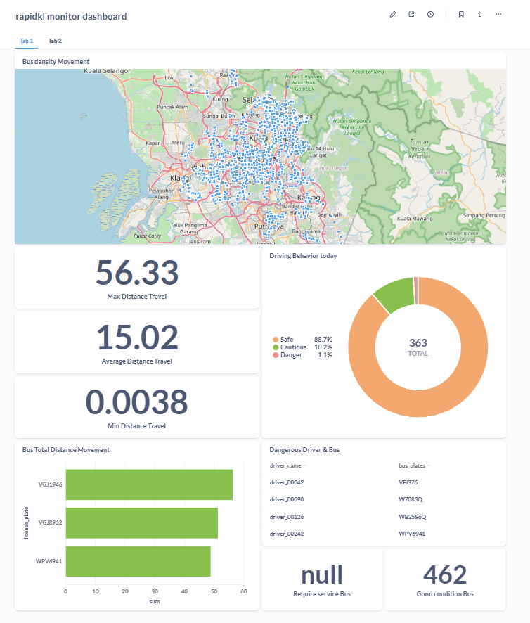
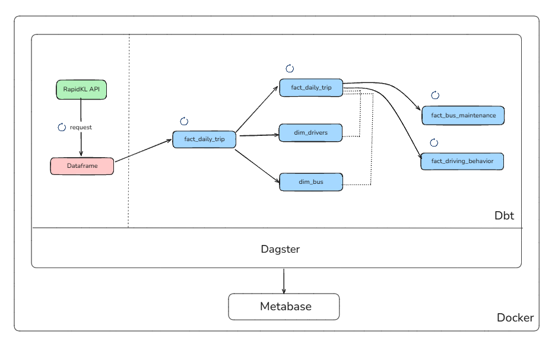

# Rapid Tracker

- A monitoring dashboard of RapidKL GTFS real-time API data  
- Data orchestrated through ELT using Dagster, Dbt and Metabase - instantiate with just docker compose!

<br>



# Getting Started

1. Create virtualenv and install packages
```
python3 -m venv venvRapid
source venvRapid/bin/activate
pip install -r requirements.txt
```

2. Setup container 

`docker compose up`

3. Dbt path setup

```
export DBT_PROJECT_DIR=/<project>/<working>/<dbt_directory>
export DBT_PROFILES_DIR=/<project>/<working>/<directory>
```

4. Start data orchestration

- Run with `<flow>.from_source(source=<if/local/use/project_path/else/githubrepoURL>).deploy()`
```
prefect server start 
prefect work-pool create --type process my-work-pool # if not yet create, else ignore
prefect worker start --pool "rapid-work-pool"
python deploy.py # get most updated version
prefect deployment run '<flow_function>/<deployment_name>'
```

3. Monitor visualization

- Go to http://localhost:3000 to see the dasboard!


# Data Orchestration Infrastructure

<br>



# TODO

- [] Add more data (daily)
- [] Convert bus density map -> current location map